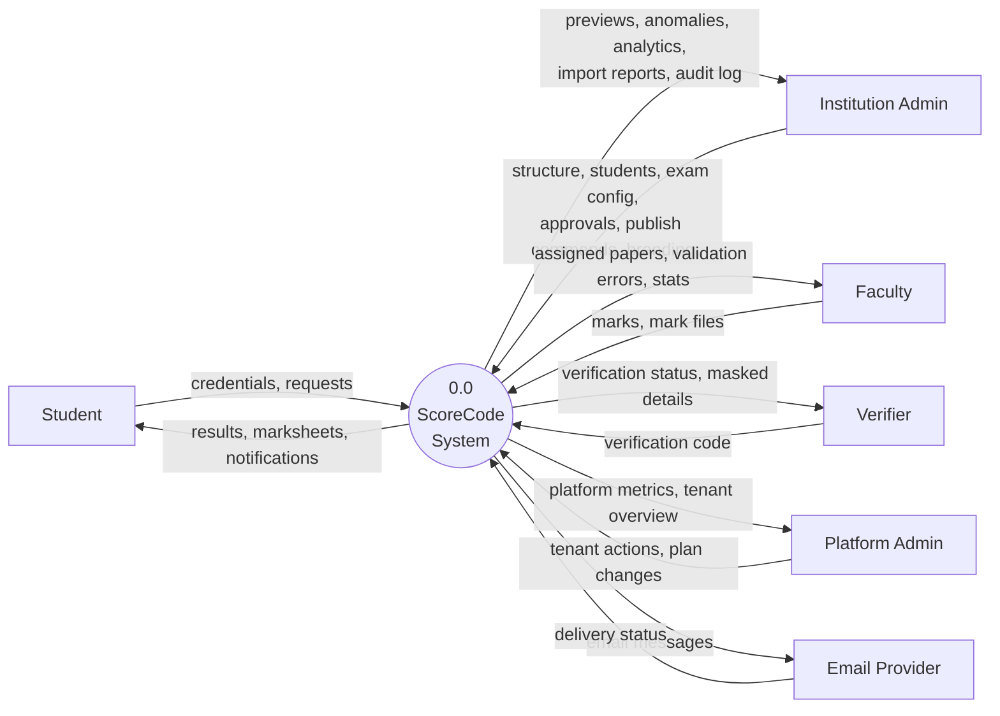
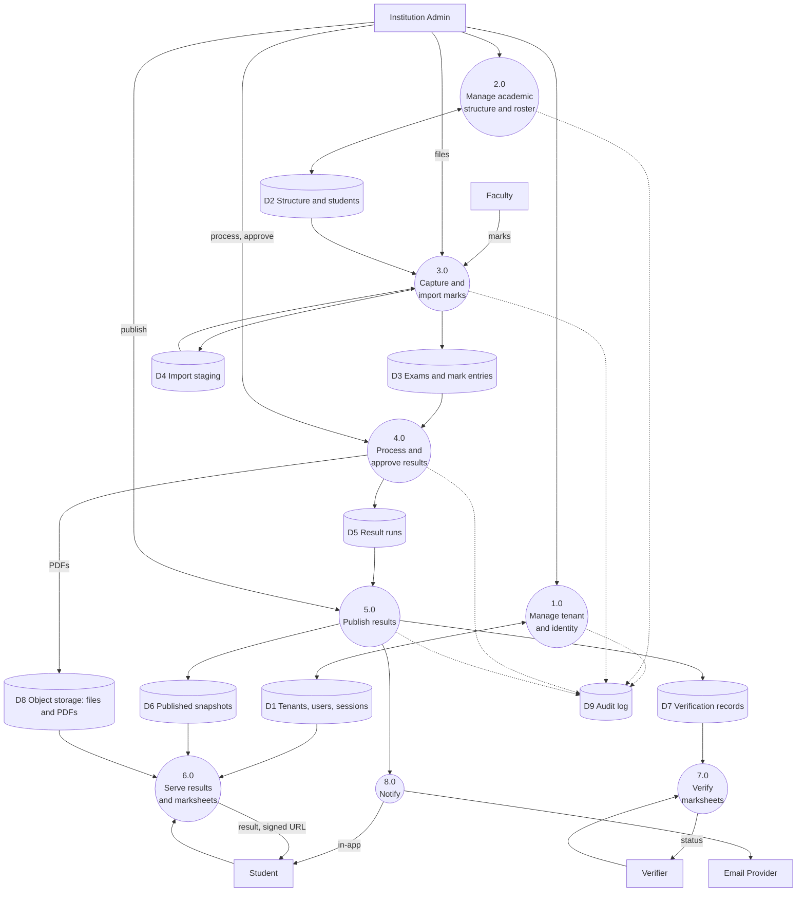

# Data Flow Diagrams

> Yourdon/DeMarco-style DFDs: rectangles = external entities, circles = processes, cylinders = data stores.

## Level 0 — context DFD

```mermaid
flowchart LR
    ST["Student"]
    FA["Faculty"]
    AD["Institution Admin"]
    PA["Platform Admin"]
    VE["Verifier"]
    EM["Email Provider"]

    P0(("0.0<br/>ScoreCode<br/>System"))

    AD -- "structure, students, exam config,<br/>approvals, publish commands, branding" --> P0
    P0 -- "previews, anomalies, analytics,<br/>import reports, audit log" --> AD
    FA -- "marks, mark files" --> P0
    P0 -- "assigned papers, validation errors, stats" --> FA
    ST -- "credentials, requests" --> P0
    P0 -- "results, marksheets, notifications" --> ST
    VE -- "verification code" --> P0
    P0 -- "verification status, masked details" --> VE
    PA -- "tenant actions, plan changes" --> P0
    P0 -- "platform metrics, tenant overview" --> PA
    P0 -- "email messages" --> EM
    EM -- "delivery status" --> P0
```

## Level 1 — main processes

```mermaid
flowchart TB
    AD["Institution Admin"]
    FA["Faculty"]
    ST["Student"]
    VE["Verifier"]
    EM["Email Provider"]

    P1(("1.0<br/>Manage tenant<br/>and identity"))
    P2(("2.0<br/>Manage academic<br/>structure and roster"))
    P3(("3.0<br/>Capture and<br/>import marks"))
    P4(("4.0<br/>Process and<br/>approve results"))
    P5(("5.0<br/>Publish results"))
    P6(("6.0<br/>Serve results<br/>and marksheets"))
    P7(("7.0<br/>Verify<br/>marksheets"))
    P8(("8.0<br/>Notify"))

    D1[("D1 Tenants, users, sessions")]
    D2[("D2 Structure and students")]
    D3[("D3 Exams and mark entries")]
    D4[("D4 Import staging")]
    D5[("D5 Result runs")]
    D6[("D6 Published snapshots")]
    D7[("D7 Verification records")]
    D8[("D8 Object storage: files and PDFs")]
    D9[("D9 Audit log")]

    AD --> P1
    P1 <--> D1
    AD --> P2
    P2 <--> D2
    FA -- marks --> P3
    AD -- files --> P3
    P3 --> D4
    D4 --> P3
    P3 --> D3
    D2 --> P3
    D3 --> P4
    AD -- "process, approve" --> P4
    P4 --> D5
    P4 -- PDFs --> D8
    D5 --> P5
    AD -- "publish" --> P5
    P5 --> D6
    P5 --> D7
    P5 --> P8
    P8 --> EM
    P8 -- "in-app" --> ST
    ST --> P6
    D1 --> P6
    D6 --> P6
    D8 --> P6
    P6 -- "result, signed URL" --> ST
    VE --> P7
    D7 --> P7
    P7 -- status --> VE
    P1 -.-> D9
    P2 -.-> D9
    P3 -.-> D9
    P4 -.-> D9
    P5 -.-> D9
```
